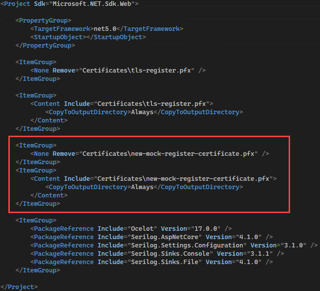
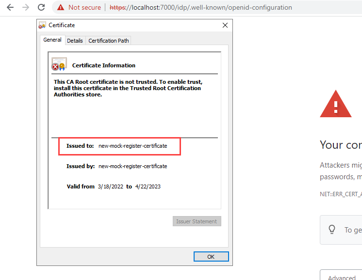

# Certificate Management

Certificates play an important part in the CDR ecosystem to establish trust between participants and protect communications.  **DigiCert** is the Certificate Authority (CA) for the CDR and the ACCC is responsible for provisioning DigiCert certificates to participants during the on-boarding process.

For more information, consult the [Certificate Management](https://consumerdatastandardsaustralia.github.io/standards/#certificate-management) section of the Consumer Data Standards.

The Mock Register will mimic the behaviour of the CDR ecosystem and therefore will use certificates in its interactions.  However, the use of DigiCert for this person is not feasible or scalable so an alternative approach must be adopted.

There are 3 areas where certificates are used within the Mock Register:
- mTLS
- TLS
- SSA signing and validation

## mTLS

**Mutual Transport Layer Security** is used extensively within the CDR ecosystem.  Data Recipients are provisioned client certificates and will present that certificate when interacting with a Data Holder for consumer data sharing and with the Register when discovering Data Holder Brands and request an SSA.  Data Holders are issued a server certificate for their side of the interaction.  All participants need to validate the certificates presented during the establishment of a mTLS session.

The mTLS certificates that can be used for Mock Solutions are listed below:

| Participant | File Name | Password |
|-------------|-----------|----------|
| Mock CA - Certificate Authority | mtls\ca.pfx | #M0ckCDRCA# |
| Mock Register - Server Certificate | mtls\register.pfx | #M0ckRegister# |
| Mock Register - Client Certificate | mtls\register-client.pfx | #M0ckRegister# |
| Mock Data Holder (Banking) - Server Certificate | mtls\server.pfx | #M0ckDataHolder# |
| Mock Data Holder (Energy) - Server Certificate | mtls\server-energy.pfx | #M0ckDataHolder# |
| Mock Data Recipient - Client Certificate | mtls\client.pfx | #M0ckDataRecipient# |

### Certificate Authority

A self-signed Root CA has been provisioned to handle certificate provisioning and to be used in the certificate validation processes.  The client certificate/s for a data recipient and the server certificate for a data holder will be generated from the self-signed Root CA.  The Register, DHs and DRs will trust valid certificates that have been generated from the self-signed Root CA.

The `openssl` commands to generate the Mock CDR Certificate Authority can be found in: `mtls\ca.cmd`.

### Mock Register - Server Certificate

The Mock Register is issued a server certificate by the Mock CDR CA for mTLS communication.

The `openssl` commands to generate the server certificate by the Mock CDR Certificate Authority can be found in: `mtls\register.cmd`.

### Mock Register - Client Certificate

The Mock Register is issued a client certificate by the Mock CDR CA for mTLS communication.

The `openssl` commands to generate the server certificate by the Mock CDR Certificate Authority can be found in: `mtls\register-client.cmd`.

### Mock Data Holder - Server Certificate

A Data Holder can use the server certificate issued by the Mock CDR CA for mTLS communication.

The `openssl` commands to generate the server certificate by the Mock CDR Certificate Authority can be found in: `mtls\server.cmd`.  One has already been generated and is available at: `mtls\server.pfx`.

### Mock Data Recipient - Client Certificate

A Data Recipient can use the client certificate issued by the Mock CDR CA for mTLS communication.

The `openssl` commands to generate the client certificate by the Mock CDR Certificate Authority can be found in: `mtls\client.cmd`.  One has already been generated and is available at: `mtls\client.pfx`.  This certificate has been configured for use within the metadata stored within the Mock Register repository.

NOTE: If the `mtls\client.pfx` is updated then the thumbprint of the new certificate needs to be replace the thumbprint in the seed data and postman collection.

## TLS

Endpoints that are not protected by mTLS are protected by TLS.  The server certificate used for TLS communication can be provisioned by the CDR CA, or alternatively participants can used a trusted third party CA.

For the mock solutions, self-signed TLS certificates are used.  These self-signed certificates will be signed by the Mock CDR CA, like the mTLS certificates.

Some certificates have been generated already and are available in the `tls` folder:

| Participant | File Name | Password |
|-------------|-----------|----------|
| Mock Register | tls\mock-register.pfx | #M0ckRegister# |
| Mock Data Holder (Banking) | tls\mock-data-holder.pfx | #M0ckDataHolder# |
| Mock Data Holder (Energy) | tls\mock-data-holder-energy.pfx | #M0ckDataHolder# |
| Mock Data Recipient | tls\mock-data-recipient.pfx | #M0ckDataRecipient# |

These certificates can be used by the community when developing CDR solutions, or you can generate your own self-signed certificates or alternatively use a third party generated certificate.

## SSA Signing and Validation

When a Data Recipient requests a Software Statement Assertion (SSA) from the Register, the contents of the SSA is signed by a private key managed by the Register.  The Data Holder that receives the SSA can verify its authenticity by utilising the public key data hosted at the Register's SSA JWKS endpoint (`/cdr-register/v1/jwks`).

The private/public key information used within the SSA and Dynamic Client Registration (DCR) process utilises an X509 certificate.  This certificate is a self-signed certificate that is generated using the `openssl` commands found in the `ssa\ssa.cmd` file.

| Participant | File Name | Password |
|-------------|-----------|----------|
| Mock Register | ssa\ssa.pfx | #M0ckRegister# |

## How To: Replace the certificates used in the Mock Register

The TLS and mTLS gateway projects are the external facing endpoints of the Mock Register.  The gateway projects receive the incoming requests and route them to the appropriate backend service.  So when a client connects to the Mock Register, they are connecting via the TLS abd mTLS gateways.

Therefore, to change the certificates that a client interacts with on the TLS/mTLS handshake, the certificate configured for the TLS and mTLS gateways need to be changed.

The steps to do this are outlined below:


1. Clone the Mock Register repository from (GitHub)[https://github.com/ConsumerDataRight/mock-register].

```
git clone https://github.com/ConsumerDataRight/mock-register.git
```

2. Browse to the `mock-register/source/CDR.Register.API.Gateway.TLS/Certificates` folder.

3. Copy the new certificate into this location.

4. Edit the `appsettings.json` file in the `mock-register/source/CDR.Register.API.Gateway.TLS` folder.

5. Change the `Kestrel.Endpoints.Https.Certificate` settings with details for the new certificate:

```
"Kestrel": {
    "Endpoints": {
        "Https": {
            "Url": "https://0.0.0.0:7000",
            "Certificate": {
                "Path": "Certificates/{new certificate file name}",
                "Password": "{new certificate password}"
            }
        }
    }
}
```

For e.g.:

```
"Kestrel": {
    "Endpoints": {
        "Https": {
            "Url": "https://0.0.0.0:7000",
            "Certificate": {
                "Path": "Certificates/new-mock-register-certificate.pfx",
                "Password": "#Password#"
            }
        }
    }
}
```

6. Save the `appSettings.json` file.

7. Edit the `CDR.Register.API.Gateway.TLS.csproj` file in the `mock-register/source/CDR.Register.API.Gateway.TLS` folder, to include the new certificate file into the output.

Add the following elements:

```
<ItemGroup>
    <None Remove="Certificates\{new certificate file name}" />
</ItemGroup>
<ItemGroup>
    <Content Include="Certificates\{new certificate file name}">
        <CopyToOutputDirectory>Always</CopyToOutputDirectory>
    </Content>
</ItemGroup>
```

For e.g.:

[](updated-register-cert-csproj.png)

7. Repeat for the mTLS gateway (`mock-register/source/CDR.Register.API.Gateway.mTLS`), if required.

8. From the `mock-register/source` directory, build and run the container:

To get help building and running the container, see the [help guide](../Help/container/HELP.md).

9. Browse to an endpoint to check the certificate:

[](updated-register-cert.png)
