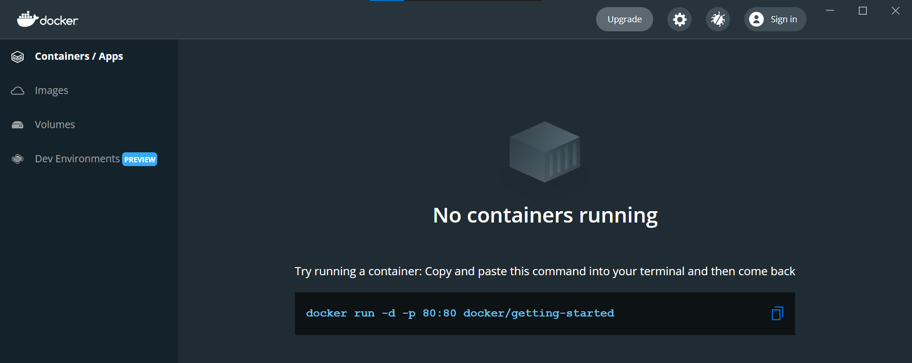
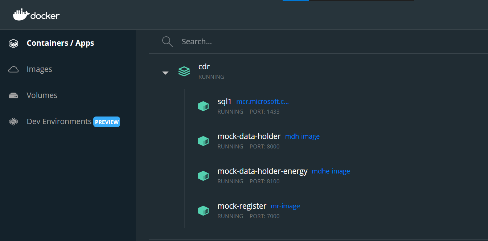
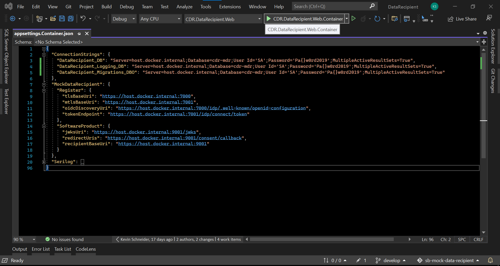
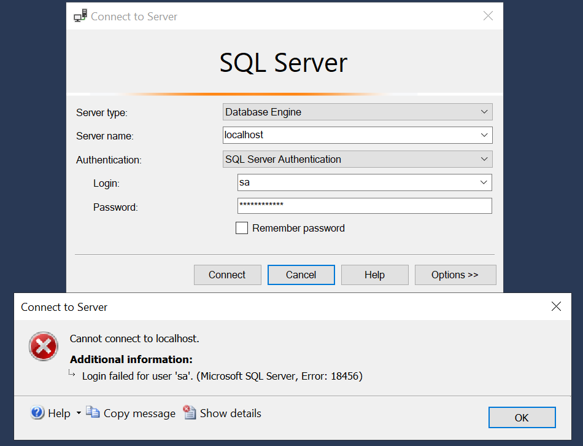

<h2>Use the pre-built image for this solution</h2>

 

1. Pull the latest image from <a href="https://hub.docker.com/r/consumerdataright/mock-register" title="Download the from docker hub here" alt="Download the from docker hub here">Docker Hub</a>

	docker pull consumerdataright/mock-register

 

2. Run the Mock Register container

	docker run -d -h mock-register -p 7000:7000 -p 7001:7001 -p 7006:7006 --add-host=host.docker.internal:host-gateway --name mock-register consumerdataright/mock-register
	  
	docker run -d -e "ACCEPT_EULA=Y" -e "SA_PASSWORD=Pa{}w0rd2019" -p 1433:1433 --name sql1 -h sql1 -d mcr.microsoft.com/mssql/server:2019-latest
	  
	Please note - This docker compose file utilises the Microsoft SQL Server Image from Docker Hub. 
	The Microsoft EULA for the Microsoft SQL Server Image must be accepted to continue. 
	See the Microsoft SQL Server Image on Docker Hub for more information. 
	Using the above command from a MS Windows command prompt will run the database. 

 

3. Use the docker compose file to run a multi-container mock CDR Ecosystem.

	The <a href="../../Source/DockerCompose/docker-compose.yml" title="/DockerCompose/docker-compose.yml" alt="Use the docker compose file located here - /DockerCompose/docker-compose.yml">docker compose file</a> can be used to run multiple containers from the Mock CDR Ecosystem, by starting the <a href="https://hub.docker.com/editions/community/docker-ce-desktop-windows" title="Docker Desktop for Windows" alt="Docker Desktop for Windows">docker desktop</a>
	 (if using a non MS Windows environment, you will need to add this route to the network), this will be added to your hosts file and is used for inter container connectivity via your host IP Address, eg C:\Windows\System32\drivers\etc\hosts

 

	###.###.###.### host.docker.internal

 

4. Execute the <a href="../../Source/DockerCompose/docker-compose.yml" title="/DockerCompose/docker-compose.yml" alt="Use the docker compose file located here - /DockerCompose/docker-compose.yml">docker compose file</a>, the default configuration is to run all mock solutions and executing the comand below will run all the solutions.

	docker-compose up

 
 

	Please note - This docker compose file utilises the Microsoft SQL Server Image from Docker Hub. 
	The Microsoft EULA for the Microsoft SQL Server Image must be accepted to continue. 
	Replace this unset ACCEPT_MSSQL_EULA variable with a Y if you accept the EULA. eg ACCEPT_EULA=Y 
	See the Microsoft SQL Server Image on Docker Hub for more information. 

	Should you wish to switch out your own solution, remark the relevant code out of this file. 
	In this example we will be simulating the switching out of our Mock Data Recipient, we are using the 
	database connection string Server=host.docker.internal and the endpoints shown below to 
	connect to the running containers, this will result in the Mock Data Recipient running in MS Visual Studio, 
	connected to the Mock Register and the Mock Data Holder running in docker. 
	For details on how to run a Mock solution in MS Visual Studio 
	see <a href="../debugging/HELP.md" title="Debug Help Guide" alt="View the Debug Help Guide.">help guide</a>

 
 

	How to build your own image instead of downloading it from docker hub. 
	navigate to .\mock-register\Source 
	open a command prompt and execute the following; 
	docker build -f Dockerfile.container -t mock-register . 
	docker run -d -h mr-host -p 7000:7000 -p 7001:7001 -p 7006:7006 --add-host=host.docker.internal:host-gateway --name mock-register mock-register 
	Please note - By default, the container above will be using a MS SQL database container, using this command from a MS Windows command prompt will run the database,  
	docker run -d -e "ACCEPT_EULA=Y" -e "SA_PASSWORD=Pa{}w0rd2019" -p 1433:1433 --name sql1 -h sql1 -d mcr.microsoft.com/mssql/server:2019-latest

	You can connect to the MS SQL database container from MS Sql Server Management Studio (SSMS) using
	the following settings;  
	Server type: Database Engine  
	Server name: localhost  
	Authentication: SQL Server Authentication  
	Login: sa  
	Password: Pa{}w0rd2019  

 

	(Please note - if the above error occurs whilst trying to connect to the MS SQL container, the SQL Server Service MUST BE STOPPED, you can do this from SQL Server Manager)

5. The running solution

	Our switched out Mock Data Recipient solution will now be running.

