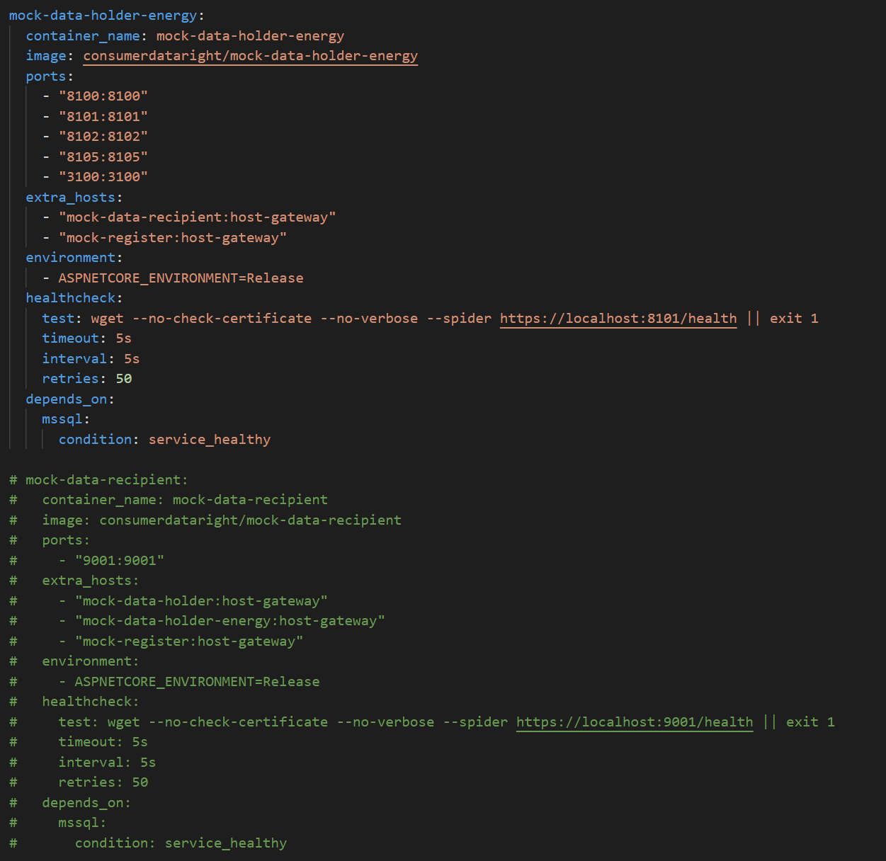
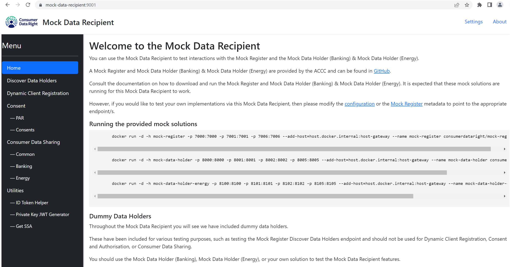

# Use the pre-built image

The Mock Register image is available on [Docker Hub](https://hub.docker.com/r/consumerdataright/mock-register).

There are a number of ways that this image can be used.

## Pull the Mock Register image from Docker Hub

Run the following command to pull the latest image from Docker Hub:

```
docker pull consumerdataright/mock-register
```

You can also pull a specific image by supplying a tag, such as the name of the branch ("main" or "develop") or a release number:

```
# Pull the image from the main branch
docker pull consumerdataright/mock-register:main

# Pull the 0.5.0 version of the image
docker pull consumerdataright/mock-register:0.5.0
```

## Run a multi-container Mock CDR Ecosystem

Multiple containers can be run concurrently to simulate a CDR ecosystem.  The [Mock Register](https://github.com/ConsumerDataRight/mock-register), the [Banking and Energy Mock Data Holders](https://github.com/ConsumerDataRight/mock-data-holder) and [Mock Data Recipient](https://github.com/ConsumerDataRight/mock-data-recipient) containers can be run by using the `docker-compose.Ecosystem.yml` file.

The Mock CDR Ecosystem relies on SQL Server for data persistence so the container has a dependency on the SQL Server container image provided by Microsoft.

In order to run the Mock CDR Ecosystem and related SQL Server instance, use the provided `docker-compose.Ecosystem.yml` file.

```
# Navigate to the Source directory where the docker-compose.Ecosystem.yml file is located.
cd .\Source\DockerCompose

# Run the Mock CDR Ecosystem and SQL Server containers.
docker-compose -f docker-compose.Ecosystem.yml up -d

# When finished, stop the containers.
docker-compose down
```
### Note: EULA for SQL Server
The `docker-compose.Ecosystem.yml` file utilises the Microsoft SQL Server Image from Docker Hub. The Microsoft EULA for the Microsoft SQL Server Image must be accepted to continue.
Set the `ACCEPT_EULA` environment variable to `Y` within the `docker-compose.Ecosystem.yml` if you accept the EULA.
See the [Microsoft SQL Server Image](https://hub.docker.com/_/microsoft-mssql-server) on Docker Hub for more information.

Example of accepting the `ACCEPT_EULA` environment variable of the SQL Server container.
```
  mssql:
    container_name: sql1
    image: 'mcr.microsoft.com/mssql/server:2022-latest'
    ports:
      - '1433:1433'
    environment:
      - ACCEPT_EULA=Y
```

### Note: Mock host names

Each Mock solution has a default host name, as per below:

| Mock solution           | Default host name       |
|-------------------------|-------------------------|
| Mock Register           | mock-register           |
| Mock Data Holder        | mock-data-holder        |
| Mock Data Holder Energy | mock-data-holder-energy |
| Mock Data Recipient     | mock-data-recipient     |

To resolve these host names, each of these host names can be registered in the local machine's `hosts` file (located in C:\Windows\System32\drivers\etc\).

```
127.0.0.1   mock-register
127.0.0.1   mock-data-holder
127.0.0.1   mock-data-holder-energy
127.0.0.1   mock-data-recipient
127.0.0.1   mssql
```

### Switching out a container in the multi-container Mock CDR Ecosystem with your own solution

You can switch out one of the mock solutions running in the multi-container Mock CDR Ecosystem with a mock solution running in MS Visual Studio or with your own solution.

Within the `docker-compose.Ecosystem.yml` file, comment out the solution that you do not want to be started. E.g. The Mock Data Recipient:

[](./images/mdr-switch-out-compose-comment.png)

Start the Mock CDR Ecosystem using the docker compose file.
```
# Run the Mock CDR Ecosystem containers.
docker-compose -f docker-compose.Ecosystem.yml up -d
```

In this example we will be switching out our Mock Data Recipient. 
Clone the [Mock Data Recipient](https://github.com/ConsumerDataRight/mock-data-recipient) repository from GitHub and open the solution in MS Visual Studio.  

Build and run the Mock Data Recipient in MS Visual Studio. Our switched out Mock Data Recipient solution will now be running. This will result in the Mock Data Recipient running in MS Visual Studio, connected to the Mock Register and the Mock Data Holders running in docker.

[](./images/mdr-switch-out-running.png)

For more details on how to run a mock solution in MS Visual Studio see [help guide](../debugging/HELP.md).


## Changing the host names of the mock solutions

The host names used in the mock solutions can be changed by overriding environment variables in each container.  

For example, making the following changes to the `docker-compose.Ecosystem.yml` file will set the host name for the Mock Register to `localhost`:

```
  mock-register:
    container_name: mock-register
    image: consumerdataright/mock-register
    ports: 
      - "7000:7000"
      - "7001:7001"
      - "7006:7006"
    extra_hosts:
      - "mock-data-holder:host-gateway"
      - "mock-data-holder-energy:host-gateway"
      - "mock-data-recipient:host-gateway"      
    environment:
      - ASPNETCORE_ENVIRONMENT=Release
      - IssuerUri=https://localhost:7000/idp
      - JwksUri=https://localhost:7000/idp/.well-known/openid-configuration/jwks
      - TokenUri=https://localhost:7001/idp/connect/token
      - IdentityServerTokenUri=https://localhost:7001/idp/connect/token
      - IdentityServerUrl=https://localhost:7000/idp
      - IdentityServerIssuer=https://localhost:7000/idp
```

Similar environment variables can be set in the `docker-compose.Ecosystem.yml` file to set the host names of the other mock solutions.

The environment variables for each mock solution that require setting in order to update the host names are as follows:

| Mock solution           | Environment Variable    | Default Value |
|-------------------------|-------------------------|-----------------------------------------|
| Mock Register           | IssuerUri               | https://localhost:7000/idp |
| Mock Register           | JwksUri                 | https://localhost:7000/idp/.well-known/openid-configuration/jwks |
| Mock Register           | TokenUri                | https://localhost:7001/idp/connect/token |
| Mock Register           | IdentityServerTokenUri  | https://localhost:7001/idp/connect/token |
| Mock Register           | IdentityServerUrl       | https://localhost:7000/idp |
| Mock Register           | IdentityServerIssuer    | https://localhost:7000/idp |
| Mock Data Holder        | Domain | mock-data-holder:8000 |
| Mock Data Holder        | CdrAuthServer__Issuer | https://mock-data-holder:8001 |
| Mock Data Holder        | CdrAuthServer__BaseUri | https://mock-data-holder:8001 |
| Mock Data Holder        | CdrAuthServer__SecureBaseUri | https://mock-data-holder:8001 |
| Mock Data Holder        | CdrAuthServer__Issuer | https://mock-data-holder:8001 |
| Mock Data Holder        | AccessTokenIntrospectionEndpoint | https://mock-data-holder:8001/connect/introspect-internal |
| Mock Data Holder        | UserinfoUri | https://mock-data-holder:8002/connect/userinfo |
| Mock Data Holder        | RegisterUri | https://mock-data-holder:8002/connect/register |
| Mock Data Holder        | ParUri | https://mock-data-holder:8002/connect/par |
| Mock Data Holder        | RevocationUri | https://mock-data-holder:8002/connect/revocation |
| Mock Data Holder        | ArrangementRevocationUri | https://mock-data-holder:8002/connect/arrangements/revoke |
| Mock Data Holder        | Registration__AudienceUri | https://mock-data-holder:8001 |
| Mock Data Holder        | Register__SsaJwksUri | https://mock-register:7000/cdr-register/v1/jwks |
| Mock Data Holder        | Register__GetDataRecipientsEndpoint | https://mock-register:7000/cdr-register/v1/banking/data-recipients |
| Mock Data Holder        | Register__GetDataRecipientStatusEndpoint | https://mock-register:7000/cdr-register/v1/banking/data-recipients/status |
| Mock Data Holder        | Register__GetSoftwareProductsStatusEndpoint | https://mock-register:7000/cdr-register/v1/banking/data-recipients/brands/software-products/status |
| Mock Data Holder Energy | Domain | mock-data-holder-energy:8100 |
| Mock Data Holder Energy | CdrAuthServer__Issuer | https://mock-data-holder-energy:8101 |
| Mock Data Holder Energy | CdrAuthServer__BaseUri | https://mock-data-holder-energy:8101 |
| Mock Data Holder Energy | CdrAuthServer__SecureBaseUri | https://mock-data-holder-energy:8101 |
| Mock Data Holder Energy | CdrAuthServer__Issuer | https://mock-data-holder-energy:8101 |
| Mock Data Holder Energy | AccessTokenIntrospectionEndpoint | https://mock-data-holder-energy:8101/connect/introspect-internal |
| Mock Data Holder Energy | UserinfoUri | https://mock-data-holder-energy:8102/connect/userinfo |
| Mock Data Holder Energy | RegisterUri | https://mock-data-holder-energy:8102/connect/register |
| Mock Data Holder Energy | ParUri | https://mock-data-holder-energy:8102/connect/par |
| Mock Data Holder Energy | RevocationUri | https://mock-data-holder-energy:8102/connect/revocation |
| Mock Data Holder Energy | ArrangementRevocationUri | https://mock-data-holder-energy:8102/connect/arrangements/revoke |
| Mock Data Holder Energy | Registration__AudienceUri | https://mock-data-holder-energy:8101 |
| Mock Data Holder Energy | Register__SsaJwksUri | https://mock-register:7000/cdr-register/v1/jwks |
| Mock Data Holder Energy | Register__GetDataRecipientsEndpoint | https://mock-register:7000/cdr-register/v1/banking/data-recipients |
| Mock Data Holder Energy | Register__GetDataRecipientStatusEndpoint | https://mock-register:7000/cdr-register/v1/banking/data-recipients/status |
| Mock Data Holder Energy | Register__GetSoftwareProductsStatusEndpoint | https://mock-register:7000/cdr-register/v1/banking/data-recipients/brands/software-products/status |
| Mock Data Recipient     | MockDataRecipient__Register__tlsBaseUri | https://mock-register:7000 |
| Mock Data Recipient     | MockDataRecipient__Register__mtlsBaseUri | https://mock-register:7001 |
| Mock Data Recipient     | MockDataRecipient__Register__oidcDiscoveryUri | https://mock-register:7000/idp/.well-known/openid-configuration |
| Mock Data Recipient     | MockDataRecipient__Register__tokenEndpoint | https://mock-register:7001/idp/connect/token |
| Mock Data Recipient     | MockDataRecipient__SoftwareProduct__jwksUri | https://mock-data-recipient:9001/jwks |
| Mock Data Recipient     | MockDataRecipient__SoftwareProduct__redirectUris | https://mock-data-recipient:9001/consent/callback |
| Mock Data Recipient     | MockDataRecipient__SoftwareProduct__recipientBaseUri | https://mock-data-recipient:9001 |

### Note: Update Mock Register data
If the host names are changed, then the data stored in the Mock Register should be updated to reflect the updated mock solution endpoints.

This can be achieved by using the Admin API, as outlined in the solution README.

## Host on your own infrastructure
The mock solutions can also be hosted on your own infrastructure, such as virtual machines or kubernetes clusters, in your private data centre or in the public cloud. 
