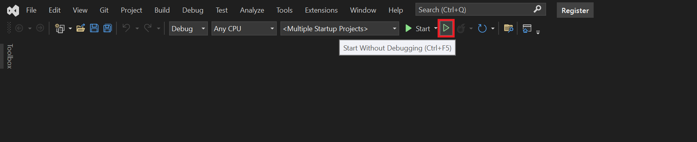

<h2>To get started, clone the source code</h2>

1. Create a folder called CDR 
2. Navigate to this folder 
3. Clone the repo as a subfolder of this folder using the following command; 

git clone https://github.com/ConsumerDataRight/mock-register.git 

4. Start the projects in the solution, can be done in multiple ways, examples below are from .Net command line and using MS Visual Studio 

<h2>.Net command line</h2>

1. Download and install the free <a href="https://docs.microsoft.com/en-us/windows/terminal/get-started" title="Download the free Windows Terminal here" alt="Download the free MS Windows Terminal here">MS Windows Terminal</a>
 
2. Use the <a href="https://github.com/ConsumerDataRight/mock-register/Source/Start-Register.bat" title="Use the Start-Register .Net CLI batch file here" alt="Use the Start-Register .Net CLI batch file here">Start-Register</a> batch file to build and run the required projects to start the Mock Register,
 
this will create the LocalDB instance by default and seed the database with the supplied sample data.

LocalDB is installed as part of MS Visual Studio if using MS VSCode then adding the MS SQL extension includes the LocalDB Instance.

You can connect to the database from MS Visual Studio using the SQL Explorer, or from MS SQL Server Management Studio (SSMS) using
	the following settings;  
	Server type: Database Engine  
	Server name: (LocalDB)\MSSQLLocalDB  
	Authentication: Windows Authentication 

<h2>MS Visual Studio</h2>

To launch the application using MS Visual Studio, multiple projects must be selected in the solution properties.

1. Navigate to the solution properties.

2. From there select the projects to start.

3. Then start the projects.

Output windows will be launched for each of the projects set to start.  
These will show the logging messages as sent to the console in each of the running projects.
 

<h3>Debugging the running projects using MS Visual Studio can be performed as follows;</h3>
 

1. Select the project you want to debug.
	 
	Stop either the MS Windows Terminal or the Output Window for the selected project to debug above.

2. Start a new debug instance for the selected project to be debugged.

A new output window for the debug project will be started.

