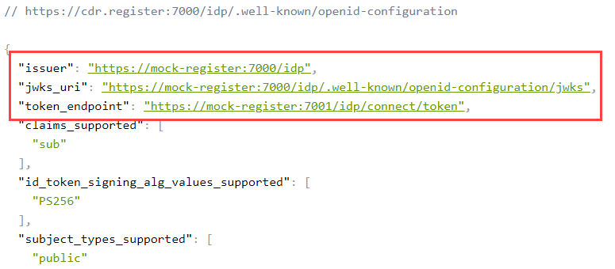
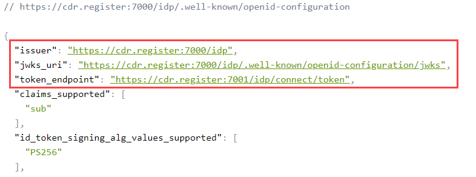

# How To: Update the hostname used in Mock Register

In order to change the hostname used in the Mock Register, there are a few places where configuration needs to be updated.

The Mock Register listens for any incoming requests to the designated ports (7000 - 7006) so will respond to any hostname used in the request as long as the traffic is routed to the container port.

For e.g., I add an entry for `cdr.register` to my DNS that points to my Mock Register container.  When I browse to `https://cdr.register:7000/idp/.well-known/openid-configuration` the Open ID Disovery Document is returned successfully.

However, there are fields in the Open ID Disovery Document that are still pointing to the previous hostname.  



In order to change this, the following configuration items need to be updated:

- Edit `CDR.Register.Admin.API\appsettings.Release.json`, and update:

```
"IdentityServerTokenUri": "https://{updated-hostname}:7001/idp/connect/token",
```

For e.g.:
```
"IdentityServerTokenUri": "https://cdr.register:7001/idp/connect/token",
```

- Edit `CDR.Register.Discovery.API\appsettings.Release.json`, and update:

```
"IdentityServerUrl": "https://{updated-hostname}:7000/idp",
"IdentityServerIssuer": "https://{updated-hostname}:7000/idp",
```

For e.g.:
```
"IdentityServerUrl": "https://cdr.register:7000/idp",
"IdentityServerIssuer": "https://cdr.register:7000/idp",
```

- Edit `CDR.Register.IdentityServer\appsettings.Release.json`, and update:

```
"IssuerUri": "https://{updated-hostname}:7000/idp",
"JwksUri": "https://{updated-hostname}:7000/idp/.well-known/openid-configuration/jwks",
"TokenUri": "https://{updated-hostname}:7001/idp/connect/token",
```

For e.g.:
```
"IssuerUri": "https://cdr.register:7000/idp",
"JwksUri": "https://cdr.register:7000/idp/.well-known/openid-configuration/jwks",
"TokenUri": "https://cdr.register:7001/idp/connect/token",
```

- Edit `CDR.Register.SSA.API\appsettings.Release.json`, and update:

```
"IdentityServerUrl": "https://{updated-hostname}:7000/idp",
"IdentityServerIssuer": "https://{updated-hostname}:7000/idp",
```

For e.g.:
```
"IdentityServerUrl": "https://cdr.register:7000/idp",
"IdentityServerIssuer": "https://cdr.register:7000/idp",
```

After the configuration items have been updated, re-build and run the container:

To get help building and running the container, see the [help guide](../container/HELP.md).

Once the container is running, browse to an Open ID Discovery Document to check:


