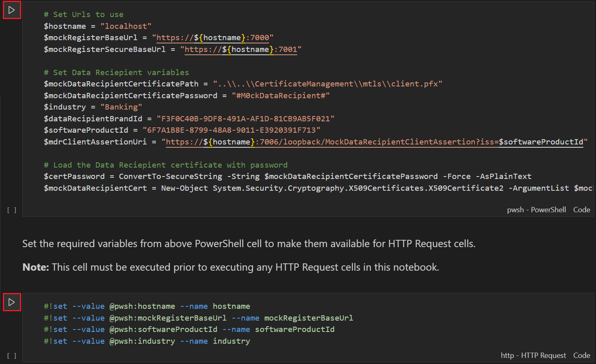

# Polyglot Notebook Guide for the Mock Register

A [Polyglot Notebook](https://code.visualstudio.com/docs/languages/polyglot) has been created for the Mock Register's APIs as a tool for demonstrating how these APIs are used.  It has the capability of invoking public APIs and mTLS APIs that require an access token.

This guide provides instructions on how to setup and use this notebook. Further information on how Polyglot Notebooks work can be found at [Polyglot Notebooks](https://code.visualstudio.com/docs/languages/polyglot).

## Prerequisites

[Visual Studio Code](https://code.visualstudio.com/) is installed and running.

[Polyglot Notebooks Extension](https://code.visualstudio.com/docs/languages/polyglot) is installed in Visual Studio Code.

A Mock Register is running as a [Docker Container](../container/HELP.md) or in [Visual Studio](../debugging/HELP.md).

## Getting Started

1. Ensure the above prerequisites are installed and running.

2. Using Visual Studio Code, open the [Mock Register Polyglot Notebook](./mock-register.ipynb).

3. Click the "Execute Cell" icons to set the required variables that will be used throughout the notebook. 

**Note:** The default configuration is setup for execution against local docker containers using a Banking industry profile.

4. Proceed to explore and execute any cells to view the request and response from the Mock Register.

For example, to invoke the Get Data Recipients API, click the "Execute Cell" icon for this cell.

## Tips

Clicking the "Run All" toolbar icon will sequentially execute all cells in this notebook.

In the event where the notebook is not responsive, try clicking the "Restart" toolbar icon to restart the current instance.

