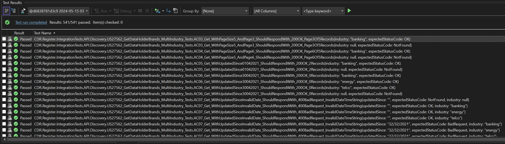
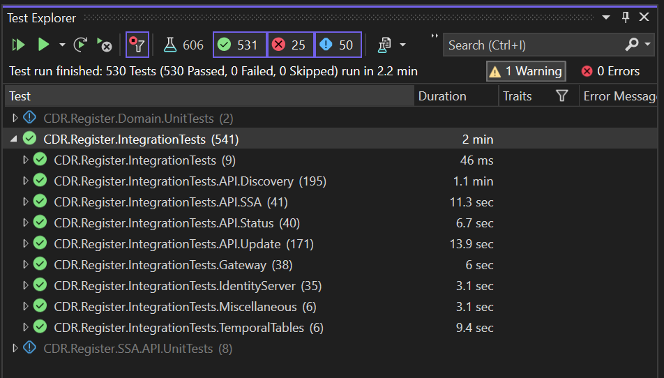

# Test Automation Execution Guide

## Table of Contents
- [Introduction](#introduction)
- [Prerequisites](#prerequisites)
- [Getting Started](#getting-started)
  - [Build or Pull a Mock Register Image](#build-or-pull-a-mock-register-image)
    - [Build a Mock Register Image](#build-a-mock-register-image)
    - [Pull and Tag the Latest Image from Docker Hub](#pull-and-tag-the-latest-image-from-docker-hub)
- [Test Execution](#test-execution)
  - [Running Tests Using the Integration Tests Docker Container](#running-tests-using-the-integration-tests-docker-container)
  - [Running Tests Using Microsoft Visual Studio](#running-tests-using-microsoft-visual-studio)
    - [Setup Local Machine Environment](#setup-local-machine-environment)
    - [Run Tests using Microsoft Visual Studio Test Explorer](#run-tests-using-microsoft-visual-studio-test-explorer)
    - [Debugging Tests](#debugging-tests)

# Introduction

This guide provides the necessary information and instructions on setting up an environment to allow for running Mock Register integration tests using both Microsoft Visual Studio's Test Explorer and Docker. It also provides different options for setting up your environment and running tests to cater for different use cases.

# Prerequisites  

[Docker Desktop](https://www.docker.com/products/docker-desktop/) is installed and running.

[Microsoft Visual Studio](https://visualstudio.microsoft.com/) is installed.


# Getting Started

Before being able to execute any Mock Register integration tests, the Mock Register docker image is required.

## Build or Pull a Mock Register Image
The Mock Register image can be either built from the GitHub [Mock Register](https://github.com/ConsumerDataRight/mock-register) repository, or pulled directly from [Docker Hub](https://hub.docker.com/r/consumerdataright/mock-register). This guide describes both options and their respective use cases.

### Build a Mock Register Image
Building your own Mock Register image may be useful if you want to make changes to any source code in the Mock Register solution. Follow the steps below to build a Mock Register image from scratch:

1. Clone the Mock Register repository using the following command.
```
git clone https://github.com/ConsumerDataRight/mock-register.git
```
2. Run the following command to build the Mock Register docker image from the `mock-register\Source` folder:
```
docker build -f Dockerfile -t mock-register .
```   
The Mock Register docker image should now be available for use in Docker. For further and more detailed documentation regarding the Mock Register, refer to the [Mock Register](https://github.com/ConsumerDataRight/mock-register) GitHub repository.

### Pull and Tag the Latest Image from Docker Hub
Pulling the latest Mock Register image from Docker Hub is a quicker and easier alternative to building your own Mock Register image from scratch. It is recommended for most cases where customisation of the Mock Register code base is not required.

This can be done by simply executing the following docker commands:
```
docker pull consumerdataright/mock-register

docker image tag consumerdataright/mock-register mock-register
```
The Mock Register image should now be available for use in Docker.

# Test Execution
Automated tests can be executed by either using a docker container or by running them directly from Microsoft Visual Studio's Test Explorer. This guide describes both options and their respective use case.

## Running Tests Using the Integration Tests Docker Container
Running tests using a docker container is useful when debugging or stepping through the test's code is not required.

The [Mock Data Register Integration Tests Compose File](../../Source/docker-compose.IntegrationTests.yml) can be executed using the docker compose command to run the tests within a docker container:

```
docker compose -f "docker-compose.IntegrationTests.yml" up -d --build
```
This docker compose command will start the necessary docker containers and automatically run the Mock Register Integration Tests. The following screenshot shows an example of the Mock Register Integration Tests being run:

[](./images/Docker-Compose-Mock-Register-Running-Tests.png.png)

Following the execution of the integration tests, a folder named '_temp' will be generated in the 'mock-register/Source' folder. This will contain test results in TRX format and any other artifacts created by the test automation execution. The TRX test results file can be opened and viewed in Microsoft Visual Studio as per example screenshot below:

[](./images/MS-Visual-Studio-View-Test-Results.png)


## Running Tests Using Microsoft Visual Studio
Running tests using Microsoft Visual Studio is required when wanting to debug or step through the test's source code.

### Setup Local Machine Environment

The following host names must be registered in the local machine's `hosts` file (located in C:\Windows\System32\drivers\etc).

```
127.0.0.1   mock-register
127.0.0.1   mssql
```

A Windows Environment variable for `ASPNETCORE_ENVIRONMENT` is required to be added and set to `Release`.

The [Mock CDR CA Certificate](../../CertificateManagement/mtls/ca.pfx) is required to be installed in the local machine's Trusted Root Certification Authorities store. 
Consult the [Certificate Management](https://github.com/ConsumerDataRight/mock-register/blob/main/CertificateManagement/README.md) documentation for more information about how certificates are used in CDR Mock Solutions.

### Setup Docker Environment
Before being able to execute tests using Microsoft Visual Studio, the Mock Register and Microsoft SQL Server docker containers need to be running.

To run the Mock Register in Docker, execute the following docker compose command from the `mock-register\Source` folder:

```
docker compose -f docker-compose.IntegrationTests.yml up -d --build mssql mock-register
```

The following screenshot shows an example of the Mock Register and Microsoft SQL Server docker containers running:

[](./images/Docker-Compose-Mock-Register-With-Sql.png)

Tests can now be run using Microsoft Visual Studio.

### Run Tests using Microsoft Visual Studio Test Explorer

The following steps detail the process of running tests using Microsoft Visual Studio's Test Explorer:

1. Open the [Register.sln](../../Source/Register.sln) solution file in Microsoft Visual Studio.
2. Build the solution.
3. Open the Test Explorer. If Test Explorer is not visible, choose 'Test' on the Visual Studio menu and then choose 'Test Explorer'.
   
   [](./images/MS-Visual-Studio-Test-Explorer.png)

4. Right click the test, or group of tests to execute and select 'Run' as per screenshot below:
   
   [](./images/MS-Visual-Studio-Test-Explorer-Run.png)

  The screenshot below is an example of successfully completed Mock Register integration test:

   [](./images/MS-Visual-Studio-Test-Explorer-Execution-Completed.png)

### Debugging Tests

To debug tests using Microsoft Visual Studio:
1. Set the required breakpoint(s) in the code you want to debug.
2. Right click the test, or group of tests you'd like to debug and select 'Debug' to begin debugging tests.

   [](./images/MS-Visual-Studio-Test-Explorer-Debug.png)

For more information on using Microsoft Test Explorer, search for 'Test Explorer' at [Microsoft Learn](https://learn.microsoft.com/).