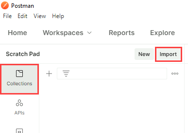
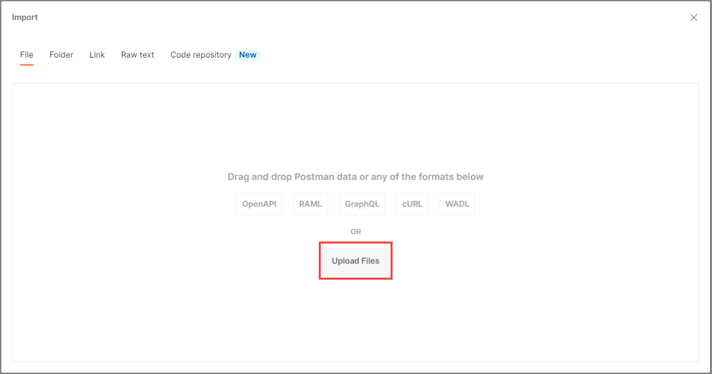
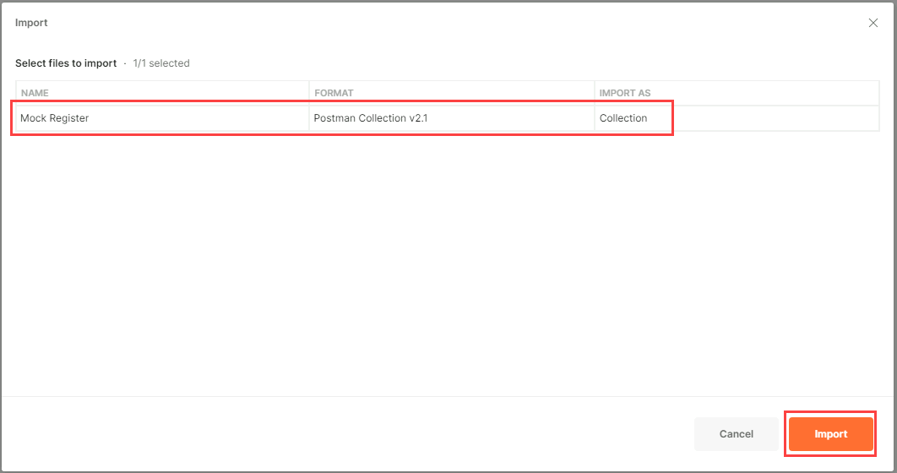
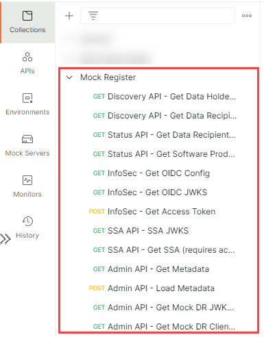
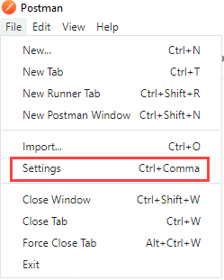
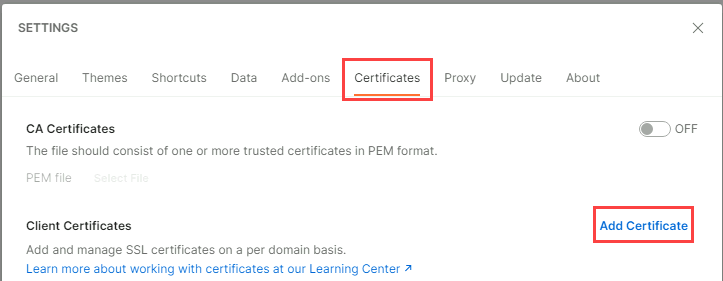
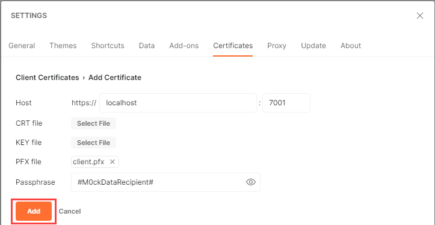

# Postman

A collection of [Postman](https://www.postman.com/) requests have been included to demonstrate the functionality of the Mock Register.

In order to use the **Postman** requests:
1. Go to [https://www.postman.com/downloads/](https://www.postman.com/downloads/) to download and install the Postman app.
2. Once installed, open the Postman app.
3. In the `Collections` section, click on the `Import` button.

4. Ensure that the [mock-register.postman_collection.json](mock-register.postman_collection.json) file has been downloaded to the local device (`git clone` or downloaded).
5. Browse for the [mock-register.postman_collection.json](mock-register.postman_collection.json) file from the `Files` tab.

6. Click on the `Import` button.

7. The `Mock Register` collection should now be available in the Postman app.

In order to make the mTLS requests (https://localhost:7001) in the Mock Register collection, a client certificate needs to be added in the Postman app.  To add the client.pfx certificate:
1. In the Postman app, click on the `Settings` option from the `File` menu.

2. In the `Settings` window, click on the `Certificates` tab and then on the `Add Certificate` option.

3. Add the `client.pfx` certificate for all requests to `https://localhost:7001`.
  - The `client.pfx` file can be found in the Mock Register repository at: `CertificateManagement/mTLS/client.pfx`.
  - The password for the `client.pfx` certificate is `#M0ckDataRecipient#`

4. The `client.pfx` certificate should now be sent to all Postman requests to the Mock Register mTLS endpoint - `https://localhost:7001`.
